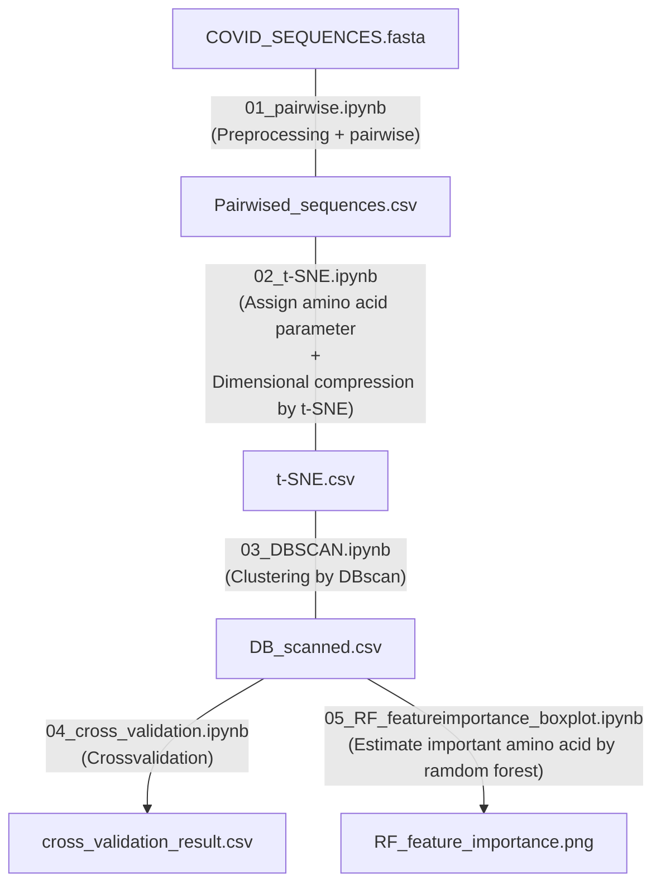

# What is Covid-tSNE?
This program is a classifier that classifies coronaviruses based on mutations in the coronavirus spike protein. It uses the amino acid **volume and hydrophilicity parameters** in the amino acid sequence of the spike protein for classification. Based on the parameters of each amino acid, dimension compression is performed using **t-SNE** and labeling is done by **DBscan**.  
after t-SNE  


after DB scan


Extract featuring amino acids by Random Forest


# Contained files
If you unzip all the .7z files in this directory, you should find **one sequence file** (.fasta), **five Jupyter notebooks** (.ipynb written in python), and **four result data** (.csv), which are the output results of each code. These four types of Jupyter notebooks process the fasta file according to the following flow. If you want to analyze the flow from the middle, you can use the corresponding result data and script. For example, "01_pairwise.ipynb" is a time-consuming script to run. If you want to do the subsequent process, you can unzip "Pairwised_sequences.7z" to run the downstrveam processing.


# Flow



# Directory structure
<pre>
.
├── 01_Pairwise.ipynb
├── 02_t-SNE.ipynb
├── 03_DBSCAN.ipynb
├── 04_cross_validation.ipynb
├── 05_RF_featureimportance_boxplot.ipynb
├── Input_fasta
│   └── COVID_SEQUENCE.7z
│ 
├── README.md
├── requirements.txt
├── Results
│   ├── after_t-sne.7z
│   ├── DB_scanned.7z
│   └── Pairwised_sequences.7z
└── tree.txt
</pre>

# Requirement
This code is run by python and written on JupyterNotebook. 
We provide a list of requirement packages in "requirements.txt".
When you install them, command
```pip install requirement.txt```

The requirements are as follows,
* asttokens==2.0.5
* backcall==0.2.0
* biopython==1.79
* colorama==0.4.4
* cycler==0.11.0
* debugpy==1.6.0
* decorator==5.1.1
* entrypoints==0.4
* executing==0.8.3
* fonttools==4.33.3
* ipykernel==6.13.0
* ipython==8.3.0
* jedi==0.18.1
* joblib==1.1.0
* jupyter-client==7.3.1
* jupyter-core==4.10.0
* kiwisolver==1.4.2
* matplotlib==3.5.2
* matplotlib-inline==0.1.3
* nest-asyncio==1.5.5
* numpy==1.22.4
* packaging==21.3
* pandas==1.4.2
* parso==0.8.3
* pickleshare==0.7.5
* Pillow==9.1.1
* prompt-toolkit==3.0.29
* psutil==5.9.1
* pure-eval==0.2.2
* Pygments==2.12.0
* pyparsing==3.0.9
* python-dateutil==2.8.2
* pytz==2022.1
* pywin32==304
* pyzmq==23.0.0
* scikit-learn==1.1.1
* scipy==1.8.1
* seaborn==0.11.2
* six==1.16.0
* sklearn==0.0
* stack-data==0.2.0
* threadpoolctl==3.1.0
* tornado==6.1
* tqdm==4.64.0
* traitlets==5.2.1.post0
* wcwidth==0.2.5
